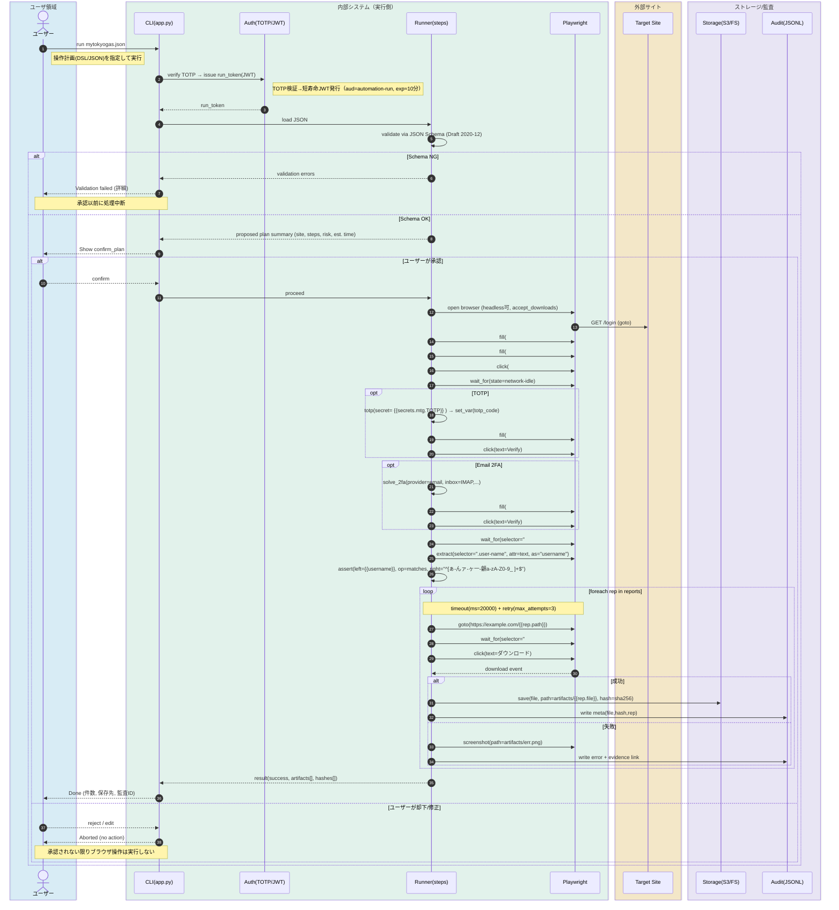

```mermaid
sequenceDiagram
  autonumber

  %% ===== グルーピング（役割別カラー） =====
  box rgba(56,189,248,0.15) ユーザ領域
    actor User as ユーザー
  end

  box rgba(167,243,208,0.20) 内部システム（実行側）
    participant CLI as CLI(app.py)
    participant Auth as Auth(TOTP/JWT)
    participant Runner as Runner(steps)
    participant PW as Playwright
  end

  box rgba(251,191,36,0.20) 外部サイト
    participant Site as Target Site
  end

  box rgba(196,181,253,0.20) ストレージ/監査
    participant Store as Storage(S3/FS)
    participant Audit as Audit(JSONL)
  end

  %% ===== フロー開始 =====
  User->>CLI: run mytokyogas.json
  Note right of User: 操作計画(DSL/JSON)を指定して実行

  %% === 実行者認証 ===
  CLI->>Auth: verify TOTP → issue run_token(JWT)
  Note right of Auth: TOTP検証→短寿命JWT発行（aud=automation-run, exp≈10分）
  Auth-->>CLI: run_token

  %% === 実行前検証 & 確認（confirm_plan） ===
  CLI->>Runner: load JSON
  Runner->>Runner: validate via JSON Schema (Draft 2020-12)
  alt Schema NG
    Runner-->>CLI: validation errors
    CLI-->>User: Validation failed (詳細)
    Note over CLI,User: 承認以前に処理中断
  else Schema OK
    Runner-->>CLI: proposed plan summary (site, steps, risk, est. time)
    CLI-->>User: Show confirm_plan
    alt ユーザーが承認
      User-->>CLI: confirm
      CLI->>Runner: proceed

      %% === ブラウザ操作共通セットアップ ===
      Runner->>PW: open browser (headless可, accept_downloads)
      PW->>Site: GET /login (goto)

      %% === ログイン ===
      Runner->>PW: fill(#user, {{secrets.mtg.USER}})
      Runner->>PW: fill(#pass, {{secrets.mtg.PASS}}, mask=true)
      Runner->>PW: click(#login)
      Runner->>PW: wait_for(state=network-idle)

      %% === 2要素（例: TOTP or Email） ===
      opt TOTP
        Runner->>Runner: totp(secret= {{secrets.mtg.TOTP}} ) → set_var(totp_code)
        Runner->>PW: fill(#otp, {{totp_code}}, mask=true)
        Runner->>PW: click(text=Verify)
      end
      opt Email 2FA
        Runner->>Runner: solve_2fa(provider=email, inbox=IMAP,...)
        Runner->>PW: fill(#otp, {{otp}}, mask=true)
        Runner->>PW: click(text=Verify)
      end

      %% === ダッシュボード到達 & 抽出/検証 ===
      Runner->>PW: wait_for(selector="#dashboard", state=visible)
      Runner->>PW: extract(selector=".user-name", attr=text, as="username")
      Runner->>Runner: assert(left={{username}}, op=matches, right="^[ぁ-んァ-ヶ一-龥a-zA-Z0-9_ ]+$")

      %% === レポート反復処理（foreach + retry/timeout） ===
      loop foreach rep in reports
        Note over Runner,PW: timeout(ms=20000) + retry(max_attempts=3)
        Runner->>PW: goto(https://example.com/{{rep.path}})
        Runner->>PW: wait_for(selector="#ready", state=visible)
        Runner->>PW: click(text=ダウンロード)
        PW-->>Runner: download event
        alt 成功
          Runner->>Store: save(file, path=artifacts/{{rep.file}}, hash=sha256)
          Runner->>Audit: write meta(file,hash,rep)
        else 失敗
          Runner->>PW: screenshot(path=artifacts/err.png)
          Runner->>Audit: write error + evidence link
        end
      end

      %% === 実行終了 ===
      Runner-->>CLI: result(success, artifacts[], hashes[])
      CLI-->>User: Done (件数, 保存先, 監査ID)

    else ユーザーが却下/修正
      User-->>CLI: reject / edit
      CLI-->>User: Aborted (no action)
      Note over CLI,User: 承認されない限りブラウザ操作は実行しない
    end
  end
```
